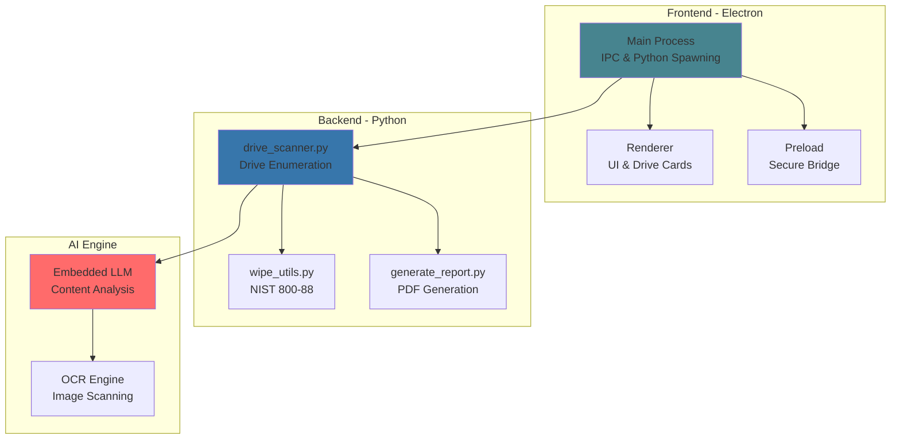

<div align="center">

# SEVE

### **S**ecure **E**rase & **V**erification **E**ngine

*Enterprise-grade drive analysis and secure data destruction tool*

[](https://www.microsoft.com/windows)
[](https://www.electronjs.org/)
[](https://www.python.org/)
[](https://nvlpubs.nist.gov/nistpubs/SpecialPublications/NIST.SP.800-88r1.pdf)
[](https://github.com)


[Features](#-core-features) • [Architecture](#-architecture) • [Quick Start](#-quick-start) • [Documentation](#-documentation) • [Vision](#-product-vision)

---

</div>

## 🎯 Overview

**SEVE** is a forensic-level desktop application for Windows that provides intelligent drive analysis, AI-powered sensitive file detection, and NIST 800-88 compliant secure data erasure with verifiable audit trails.

<div align="center">

### 🔒 **100% Offline Operation** • 🤖 **AI-Powered Analysis** • 🗑️ **Secure Wiping** • 📄 **Audit Trails**

</div>

---

## ✨ Core Features

<table>
<tr>
<td width="50%">

### 🔍 **Deep Drive Scanning**
Analyze internal and removable drives with intelligent file categorization
- Multi-drive parallel scanning
- Real-time progress tracking
- File type distribution analysis
- Storage usage visualization

</td>
<td width="50%">

### 🤖 **AI Content Analysis**
GPT-powered sensitive file detection
- Reads actual file contents (not just names)
- Context-aware pattern recognition
- Confidence scoring
- 100% offline processing

</td>
</tr>
<tr>
<td width="50%">

### 🗑️ **NIST 800-88 Compliant Wiping**
Military-grade secure erasure
- **Level 1:** Single-pass zero fill
- **Level 2:** Multi-pass random + verify
- **Level 3:** Safe clear for OS volumes
- Physical location tracking (LCN/sector)

</td>
<td width="50%">

### 📊 **Health Dashboard**
Comprehensive storage diagnostics
- SMART data monitoring
- Predictive failure warnings
- Deleted file recovery
- Performance optimization

</td>
</tr>
<tr>
<td width="50%">

### 📄 **Clearance Certificates**
Professional PDF audit reports
- Cryptographic verification
- Timestamp and file lists
- System information
- Chain of custody documentation

</td>
<td width="50%">

### 🔐 **Complete Privacy**
Zero telemetry, zero cloud
- No internet required
- No data upload
- Air-gapped compatible
- Military/government ready

</td>
</tr>
</table>

---

## 🏗️ Architecture



<details>
<summary><b>📁 Project Structure</b></summary>

```
seve-desktop/
├── 🎨 src1/                    # Electron application
│   ├── main.js                 # Main process (IPC, Python spawning)
│   ├── preload.js              # Context bridge
│   ├── renderer/               # Frontend UI
│   │   ├── index.html          # Main interface
│   │   ├── script.js           # Drive scanning logic
│   │   └── styles.css          # Dark theme
│   └── wipe_utils.py           # Secure erasure backend
│
├── 🐍 python/                  # Embedded Python 3.12
│   ├── python.exe              # Portable interpreter
│   └── Lib/site-packages/      # Bundled dependencies
│
├── 📊 report/                  # PDF generation
│   ├── generate_seve_report.py # ReportLab engine
│   └── bg.png                  # Report template
│
├── 🖼️ assets/                  # Icons and logos
├── 🔧 scripts/                 # Setup automation
├── 📦 vendor/wheels/           # Pre-downloaded packages
└── 🔍 drive_scanner.py         # Main Python backend
```

</details>

---

## � Quick Start

<div align="center">

### Prerequisites

[](https://nodejs.org/)
[](https://www.python.org/)
[](https://www.microsoft.com/windows)

</div>

```bash
# 1️⃣ Install dependencies
npm install

# 2️⃣ Setup Python environment
scripts\setup.bat

# 3️⃣ Run development mode
npm run dev

# 4️⃣ Build portable executable
npm run dist:win
```


<div align="center">

📖 **Detailed setup instructions:** [SETUP.md](SETUP.md)

</div>

---

## 🔐 Security & Privacy

<div align="center">

### 🛡️ **Zero Trust Architecture**

</div>

| Feature | Status | Description |
|---------|--------|-------------|
| 🌐 **Internet Required** | ❌ Never | Works in air-gapped environments |
| ☁️ **Cloud Processing** | ❌ Never | All AI runs locally on your machine |
| 📤 **Data Upload** | ❌ Never | Files never leave your computer |
| 📊 **Telemetry** | ❌ Never | Zero tracking or analytics |
| 🔒 **Privacy** | ✅ Complete | Military/government ready |

<details>
<summary><b>🔍 Why 100% Offline?</b></summary>

- **Sensitive Data Protection** - Data destruction requires absolute privacy
- **Forensic Integrity** - Maintain chain of custody without network contamination
- **Compliance** - GDPR, HIPAA, and government regulations
- **Secure Facilities** - Works in SCIFs and air-gapped environments
- **No Dependencies** - No reliance on external services or APIs

</details>

---

## 🗺️ SEVE Feature Set

### 🤖 AI-Powered Content Analysis

<div align="center">

**Problem:** Traditional tools only check filenames → **Solution:** AI reads actual content

</div>

<table>
<tr>
<td width="50%">

#### ❌ Traditional Detection
```
password.txt          → ✓ Flagged
bank_statement.pdf    → ✓ Flagged
password_tutorial.txt → ✓ Flagged (FALSE POSITIVE)
my_notes.txt          → ✗ Missed (contains passwords)
```

</td>
<td width="50%">

#### ✅ AI-Powered Detection
```
password.txt          → ✓ Flagged (95% confidence)
bank_statement.pdf    → ✓ Flagged (98% confidence)
password_tutorial.txt → ✗ Ignored (tutorial content)
my_notes.txt          → ✓ Flagged (contains credentials)
```

</td>
</tr>
</table>

**Features:**
- 📄 **Multi-format Support** - Text, PDF, DOCX, XLSX, images (via OCR)
- 🧠 **Context-Aware** - Distinguishes tutorials from actual sensitive data
- 🎯 **Confidence Scoring** - Each file gets a sensitivity score (0-100%)
- 🔍 **Targeted Deletion** - Review AI findings before deletion
- 🔒 **100% Offline** - Embedded LLM (LLaMA 3.2 3B / Phi-3 Mini)

**Use Case:**
> *User has 10,000 files. AI scans content and identifies only 47 files with actual sensitive data (credentials, bank info, Aadhaar numbers), allowing precise deletion instead of mass wipe.*

---

### 🔍 Storage Health & Recovery Dashboard

<div align="center">

**Comprehensive disk diagnostics + AI-powered optimization**

</div>

#### 🏥 Health Check Dashboard

<table>
<tr>
<td width="33%">

**💽 Disk Health**
- SMART data monitoring
- SSD wear leveling
- Bad sector detection
- Predictive failure alerts
- Corruption detection

</td>
<td width="33%">

**🔄 File Recovery**
- Deleted file detection
- Shift+Delete recovery
- Logical address scanning
- Preview before restore
- One-click recovery

</td>
<td width="33%">

**🔐 Sensitive Tracking**
- Track across moves/renames
- Unsecured location alerts
- Unauthorized copy detection
- Real-time monitoring

</td>
</tr>
</table>

#### 🤖 AI Storage Optimization

**Natural Language Configuration:**

```
User: "I do coding, video editing, and gaming on this system"

AI Analysis:
├─ OS & Applications    → Fast SSD (120GB)
├─ Active Projects      → SSD (250GB)
├─ Game Libraries       → Secondary SSD (500GB)
└─ Archives & Backups   → HDD (2TB)

Recommendations:
✓ Move project files to SSD for faster compile times
✓ Keep game saves on SSD, move old games to HDD
✓ Archive old video projects to HDD
✓ Estimated performance gain: 40% faster workflow
```

**Version Control Intelligence:**
- Detects duplicate files (e.g., Resume_Final.pdf vs Resume_v2.pdf)
- AI reads content (not just edit date) to find latest version
- Helps clean up redundant versions
- Works for documents, code, images

#### 📊 Dashboard Design

<div align="center">

**Professional CV-style layout** • **Interactive charts** • **Offline PDF export** • **Historical tracking**

</div>

---

### 💿 Bootable Windows Environment

<div align="center">

**Portable SEVE on bootable USB with full Windows + Electron GUI**

</div>

```
┌─────────────────────────────────────────┐
│  SEVE Bootable USB                      │
│  ┌───────────────────────────────────┐  │
│  │ Windows To Go / Windows PE        │  │
│  │ ├─ SEVE Electron App              │  │
│  │ ├─ Embedded Python 3.12           │  │
│  │ ├─ AI Models (offline)            │  │
│  │ └─ All Dependencies               │  │
│  └───────────────────────────────────┘  │
│                                          │
│  Boot → Take Control → Analyze/Wipe     │
└─────────────────────────────────────────┘
```

**Use Cases:**
- 🔧 **IT Professionals** - Service multiple client machines
- 🏢 **Data Destruction** - Portable solution for on-site work
- 🔬 **Forensic Analysis** - Analyze without contaminating evidence
- 🚨 **Emergency Recovery** - When host OS won't boot

---

### 🔬 SEVE Hardware Device

<div align="center">

**Standalone mini-CPU for independent drive operations**

</div>

```
┌──────────────────────────────────────────────────────────┐
│                  SEVE Hardware Device                     │
│  ┌────────────────────────────────────────────────────┐  │
│  │  Onboard Components:                               │  │
│  │  • ARM/x86 Processor (4-8 cores)                   │  │
│  │  • 4-8GB RAM                                       │  │
│  │  • 128-256GB SSD (OS + AI models)                 │  │
│  │  • NPU (Neural Processing Unit)                   │  │
│  │  • HDMI/DisplayPort output                        │  │
│  │  • USB-C/Thunderbolt connection                   │  │
│  │  • Independent power supply                       │  │
│  └────────────────────────────────────────────────────┘  │
│                                                           │
│  Connect → Boot Takeover → Independent Operation         │
└──────────────────────────────────────────────────────────┘
```

#### 🎯 Operating Concept

1. **Connect** - Plug SEVE hardware into target PC via USB-C
2. **Boot Takeover** - Device takes control during boot
3. **Independent Operation** - Runs on its own processor (zero host dependency)
4. **Direct Drive Access** - Communicates with storage controllers
5. **GUI Display** - Outputs interface to connected monitor
6. **Complete Control** - Scanning, analysis, wiping using only device resources

#### ⚡ Key Advantages

<table>
<tr>
<td width="50%">

**Zero Host Dependency:**
- ✅ No CPU usage from target system
- ✅ No RAM usage from target system
- ✅ Works with damaged/slow host CPU
- ✅ Consistent performance

</td>
<td width="50%">

**100% Offline AI:**
- ✅ All models in device firmware
- ✅ NPU-accelerated inference
- ✅ No internet ever required
- ✅ Complete privacy

</td>
</tr>
</table>

#### 🏢 Professional Use Cases

| Industry | Use Case | Benefit |
|----------|----------|---------|
| 🏢 **Data Centers** | Wipe hundreds of drives | No server resource usage |
| 🔬 **Forensic Labs** | Analyze with dedicated hardware | Chain of custody maintained |
| 🛡️ **Military/Gov** | Air-gapped operations | Zero network dependency |
| 💼 **Enterprise IT** | Service multiple machines | One portable device |

#### 🔧 Technical Implementation

**Hardware Platform:**
- Raspberry Pi Compute Module 4 / Custom SBC
- Custom PCB with storage controller interfaces
- AI accelerator (Google Coral / Intel Movidius / NVIDIA Jetson Nano)
- Custom enclosure with active cooling

**Software Stack:**
- Lightweight Linux kernel (Yocto/Buildroot)
- Electron runtime for GUI
- Python backend with embedded AI models
- Direct storage controller drivers (NVMe, SATA, USB)

**AI Models:**
- Quantized GPT (GGUF format) for content analysis
- NPU-accelerated inference
- LLaMA 3.2 3B / Phi-3 Mini (edge-optimized)
- Offline OCR (Tesseract)

---

## 📊 Comparison: SEVE Versions

<div align="center">

| Feature | 💻 Desktop App | 💿 Bootable USB | 🔬 Hardware Device |
|---------|----------------|-----------------|-------------------|
| **Host CPU Usage** | High | Medium | **Zero** |
| **Host RAM Usage** | 500MB-2GB | 2-4GB | **Zero** |
| **Performance** | Depends on host | Depends on host | **Consistent** |
| **Portability** | Software only | Bootable device | **Complete hardware** |
| **AI Processing** | Host CPU | Host CPU | **Dedicated NPU** |
| **Independence** | Requires host OS | Requires boot | **Fully independent** |
| **Target Users** | Individual users | IT professionals | **Enterprise/Forensic** |
| **Price Point** | Free/Low | Medium | Premium |

</div>

---

## 🎯 Product Vision

<div align="center">

```
Desktop Application  →  Bootable Environment  →  Hardware Device
     (Software)              (Portable)           (Enterprise)
```

**SEVE evolves from a desktop tool to a complete hardware solution for professional data destruction and forensic analysis.**

</div>

---

## 📚 Documentation

<div align="center">

| Document | Description |
|----------|-------------|
| 📖 [SETUP.md](SETUP.md) | Development setup and workflow |
| 🔐 [NIST 800-88](https://nvlpubs.nist.gov/nistpubs/SpecialPublications/NIST.SP.800-88r1.pdf) | Media sanitization guidelines |
| ⚡ [Electron Docs](https://www.electronjs.org/docs) | Electron framework documentation |
| 🐍 [Python Docs](https://docs.python.org/3.12/) | Python 3.12 documentation |

</div>

---

## 👥 Meet the Team

<div align="center">

### Three Developers. One Vision. Zero Compromises.

**We lost 3 months of work to a hardware failure. So we built SEVE to make sure it never happens again.**

We're not looking for investors to scale fast. We're not seeking contributors to dilute our vision.  
**We're three mad developers building the data destruction tool we wish existed.**

---

</div>

<table>
<tr>
<td align="center" width="33%">
<br/>
<h3>Utsav Singh</h3>
<i>Core Logic & Backend</i><br/><br/>
<b>Expertise:</b> Python, C/C++, Core Libraries<br/><br/>
<sub>Built the heart of SEVE - drive scanning, file analysis, and NIST 800-88 compliant wiping algorithms. Handles low-level storage operations and forensic-level data tracking also contributed to the AI Logic.</sub><br/><br/>
<a href="https://www.linkedin.com/in/utsavsingh35"></a>
<a href="https://github.com/Utsav-Singh-35"></a>
<a href="https://port-vercel-eight.vercel.app/"></a>
<a href="mailto:us101741@gmail.com"></a>
</td>
<td align="center" width="33%">
<br/>
<h3>Vikas Tiwari</h3>
<i>Frontend & Electron GUI</i><br/><br/>
<b>Expertise:</b> JavaScript, TypeScript, Electron<br/><br/>
<sub>Crafted SEVE's professional dark-themed interface. Built the Electron architecture, IPC communication, and real-time progress animations that make complex operations feel simple.</sub><br/><br/>
<a href="https://www.linkedin.com/in/1045-vikas-tiwari"></a>
<a href="https://github.com/Cyberexe1"></a>
<a href="https://vikas-tiwari-portfolio.vercel.app/"></a>
<a href="mailto:vikastiwari1045@gmail.com"></a>
</td>
<td align="center" width="33%">
<br/>
<h3>Om Singh</h3>
<i>Integration & Hardware</i><br/><br/>
<b>Expertise:</b> AI/LLaMA, Arduino, Raspberry Pi, ESP32<br/><br/>
<sub>Integrated all components into a cohesive product. Leading the 100% offline AI implementation and bootable USB development. Architecting the future hardware device.</sub><br/><br/>
<a href="https://www.linkedin.com/in/5797omsingh"></a>
<a href="https://github.com/Jayom5797"></a>
<a href="https://om07.vercel.app/"></a>
<a href="mailto:jayom5797@gmail.com"></a>
</td>
</tr>
</table>

<div align="center">

---

### 🔥 Reason behind re-building SEVE

We started building SEVE to create a smarter way to wipe data.  
While testing an open-source erasure tool for reference, we accidentally wiped our entire system—taking SEVE’s final codebase and documentation with it.  
The only thing that survived was an older version sitting on a disconnected pendrive, missing a few changes but still enough to rebuild from.  
Starting over forced us to rethink everything: safety checks, verification, documentation, and version control.  
That experience shaped SEVE into a reliable, production-ready solution with careful workflows and growing AI and hardware support.

We learned the hard way what careless data erasure can cost.  
That’s why SEVE treats destruction as something deliberate and accountable—because data loss is personal, and secure destruction should be too.


---

### 💪 Why This Team?

**🎯 Complementary Skills**
- **Utsav** - Low-level systems and algorithms
- **Vikas** - User experience and frontend architecture  
- **Om** - Integration, AI, and hardware innovation

**� Proven Execution**
- Built a working product in 3 months
- Recovered from total documentation loss
- Rebuilt stronger with proper version control
- Already planning next-gen hardware

**🛡️ Shared Vision**
- 100% offline operation (no compromises)
- AI-powered intelligence (local processing only)
- Hardware evolution (desktop → bootable → standalone device)
- Enterprise-grade quality (military/government ready)

**💎 No Distractions**
- Not hiring (lean and focused)
- Not seeking contributors (clear vision)
- Not chasing trends (solving real problems)
- Not compromising (building it right)

---

**Team ByteCode (ECHLON)** - *Three developers who refuse to compromise on data security.*

**Get in Touch:**  
For inquiries about SEVE or potential collaboration, reach out to any team member above.

</div>

---

## ⚠️ Legal Notice

<div align="center">

### ⚠️ **WARNING: This tool performs irreversible data destruction.** ⚠️

Always verify drive selection before wiping operations.

The team is not responsible for data loss due to user error.

---

*SEVE - Secure Erase & Verification Engine*

*Developed by Team ByteCode (ECHLON)*

[](https://github.com)
[](https://github.com)
[](https://nvlpubs.nist.gov/nistpubs/SpecialPublications/NIST.SP.800-88r1.pdf)

</div>
